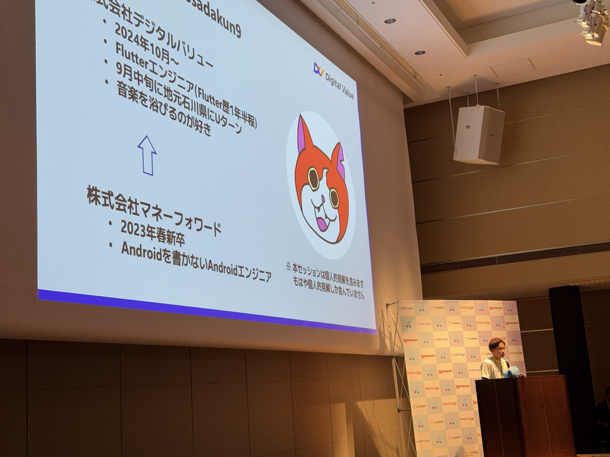
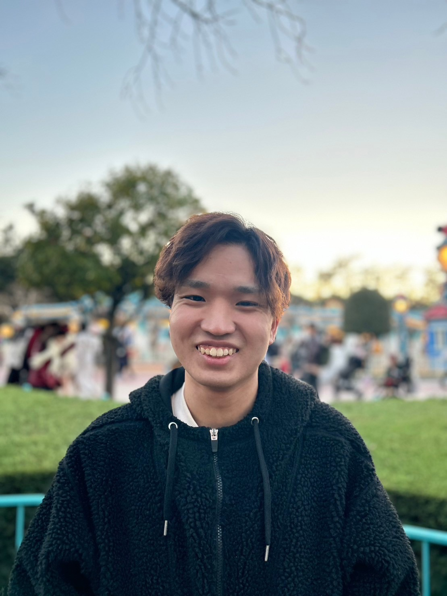

# RESUME

## 基本情報

|||
|---|---|
|氏名|小野 紀輝(Ono Toshiki)|
|年齢|25歳|
|GitHub|[osadakun](https://github.com/osadakun)|
|居住地|石川県金沢市|
|趣味|スニーカー収集・バドミントン・音楽フェス参戦|

## 技術スタック

### 言語
#### Dart（経験年数3年）
- 主にFlutterを用いたモバイルアプリ開発に使用
- Dartの基本文法、非同期処理、コレクション、関数型プログラミングの理解
- Flutterのウィジェットライブラリを活用したUI実装
- アプリの設計・開発・リリースまでの一連の流れを経験
- MVVMアーキテクチャの理解が好きで、よく好んで使っています
- よく使うパッケージ
  - Dio
  - Riverpod
　  - riverpod_generator
　  - riverpod_annotation
  - Flutter Hooks
    - テスト観点であまりチーム開発ではあまり使っていません
  - Freezed
- 個人開発ではよくFlutter×Supabaseを使っています

#### Ruby（経験年数１年）
- Ruby on Railsを用いたバックエンド開発に使用
- Rubyの基本文法、オブジェクト指向プログラミングの理解
- RailsのMVCアーキテクチャを理解し、RESTfulなAPI設計が可能
- ActiveRecordを用いたデータベース操作
- RSpecを用いたテストコードの作成

#### Python（経験年数１年）
- スクリプト言語として使用
- Pythonの基本文法、データ構造、関数型プログラミングの理解
- Flaskを用いた簡易なWebアプリケーションの開発

#### Terraform（学習中）
- AzureリソースのIaC管理に使用
- 基本文法、リソース定義、状態管理をキャッチアップ中

### その他
- Git/GitHub/Azure DevOpsによるチーム開発
- アジャイル・スクラムによるチーム開発
- 複数チームのリーダー経験
- API/テーブル設計
- CI/CDの導入経験
  - GitHub Actions
  - Azure DevOps Pipelines
  - Bitrise
- テスト自動化
  - Flutter Golden Test
  - Flutter Widget Test
  - RSpec
- AIコーディングツール
  - Claude Code
  - GitHub Copilot
  - Codex
- 英語
  - 読み書きは可能（TOEIC 720）
  - 会話は得意ではないが業務で使用していた経験あり
- プロジェクトマネージャー経験あり
  - チームメンバーとのコミュニケーションを重視し、円滑な開発環境を構築

---
## 職務経歴

### 株式会社マネーフォワード（2023年4月 ~ 2024年9月）

#### 役職・業務内容：
- モバイルエンジニアとして、主に**マネーフォワードME**の開発・保守・運用に従事
- インターン時はサーバーサイドエンジニアとして、社内システムの機能改善やマネーフォワードMEの機能追加・改善に従事

#### 実績：

- **サーバーサイド開発（インターン・週2日稼働）**
  - 社内システムの機能改善、バグ修正を担当（2022年4月 ~ 8月）
  - マネーフォワードMEの保守・機能追加（2022年9月 ~ 2023年4月）
  - 主に既定仕様に基づく実装・バグ改修業務を実施

- **モバイルアプリ開発（2023年4月 ~ 2024年3月）**
  - KotlinによるAndroidアプリの保守・リリース
  - Flutterによる「資産画面」内「推移」機能のFlutterでのリプレイスを主担当(合計1ヶ月程度で完遂)(内容は[こちら](https://note.com/me_moneyforward/n/nb8dd723ee263#2e6bfe02-f2ec-4ae9-9d9b-ab4bb2d89e6a)を参考にしてください)
  - その他Flutterを用いた機能追加・改善業務を担当
  - GoldenTestの導入を行い、UIテストの自動化を実施
　  - Bitriseに追加を行い、CI/CD環境での自動テストを実施
　  - [Flutterの既存プロダクトに Golden Testを導入する](https://moneyforward-dev.jp/entry/2023/12/08/155825)

- **スモールチームでのプロジェクトマネージャー業務(2024年４月〜2024年８月)**
  - 非日本語話者である2名(1名は東京オフィス、もう1名はベトナムオフィス)のエンジニアと共にマネーフォワーMEの機能改善を担当
  - スクラム開発を実施し、スプリント計画・デイリースクラム・レトロスペクティブを実施

- **インターン生のメンター（2024年4月〜9月）**
  - 週4稼働のモバイルエンジニアに対し、業務支援・技術指導・日々のメンタリングを実施

### 株式会社デジタルバリュー（2024年10月 ~ 現在）
#### 役職・業務内容：
- Flutterエンジニアとして、主に**Flutterを用いた新規モバイルアプリ開発**に従事
- デザインドリブンな開発を行い、FigmaベースでUI実装を行うためのルールの策定
- 生成AIを用いたFigmaデザインからのテストケース生成、それらとMaestroを用いた自動テストの推進
- CI/CD環境の構築を行い、Azure DevOps Pipelinesを用いた自動テスト・デプロイを導入
- 生成AI駆動開発、それに付随するルール・プロセス整備のリード
- インフラエンジニアとして、Azureを用いたクラウドインフラの保守・運用を担当（2026年1月〜）

#### 実績：

- **新規モバイルアプリ開発(2024年10月〜2025年5月)**
  - [one paretto](https://www.hokkokubank.co.jp/customer/use/oneparetto/)という北國銀行の新規アプリ開発に従事
  - Flutterを用いたUI実装、状態管理、API連携、パフォーマンス改善を担当
  - Azure DevOps Pipelinesを用いたCI/CD環境の構築を担当
  - Figmaベースでのデザインドリブンな開発を推進し、UI実装のルール策定を担当

- **認証基盤チームの立ち上げ兼リーダー業(2025年7月〜2026年1月)**
  - 既存認証基盤の抱える問題点を解決するため、認証基盤チームを立ち上げ、2名のメンバーをリード
  - Auth0・Azure Entra External ID・Identity Platformの3サービスについてPoCを実施し、機能・コスト・運用性の観点から比較検討
  - 各サービスの説明会・比較表の作成などドキュメント整備を担当
  - Auth0を有力候補として社内選定を進行中（移行は2026年6月頃開始予定）
  - インフラチーム移籍後も新認証基盤のインフラ構築を引き続き担当予定

- **インフラチームへの参加(2026年1月〜現在)**
  - AzureリソースのIaC管理のためTerraformをキャッチアップしながら保守・運用を担当
  - 6名チームにおいてテックリード不在の状況でコードレビューがボトルネックになっていることを特定
  - Claude Codeのスラッシュコマンド・Skillsとしてコーディングルール・PR作成・既存リソースへの影響調査コマンドを整備し、READMEとともにチームに展開
  - チームメンバー自身も便利コマンドを作成するなど積極的な活用につながり、開発プロセスの改善に貢献

#### 実績(社内課外活動)
- **社内向けにAI技術の導入を推進/整備を行う(2025年7月〜現在)**
  - 社内でのAI技術の活用を推進するため、情報収集や技術検証を担当
  - 社内向けAIサービスのクイックスタートドキュメント作成・稟議フロー整備・利用ガイドライン（許可/禁止事項）の策定を実施
  - MCPハンズオン（参加者約40名）、Vibe Codingワークショップ（参加者約60名・GitHub Copilot活用・Custom Instructions/Promptsファイルの書き方・仕様駆動開発の実践）などの社内イベントを企画/運営/登壇
  - 生成AIを既存の人事評価項目に組み込むための素案作成を推進中
  - 週1回の定例と週10%ルールのもと継続的に活動中

## 自己PR
Flutterを中心としたクロスプラットフォーム開発を得意としています。UI実装だけでなく、状態管理やAPI連携、パフォーマンス改善などにも関心があります。
また自動化という文脈に強い興味があり、CI/CDの導入やテスト自動化に取り組んできました。
直近ではインフラ領域にキャリアを広げており、Terraform・Azureを活用したIaC・クラウドインフラの保守運用に取り組んでいます。
趣味の延長で小中学生のバドミントンのコーチを5年ほど続けています。人と接することが好きで、チームメンバーとの密なコミュニケーションを大切にしています。

---

## 実績
- 勉強会でのLT登壇
  - [勉強会Compass](https://moneyforward.connpass.com/event/319889/)
  - [資料](https://speakerdeck.com/toshiki9/fl-cahrtdeji-shang-mian-gurahuwoshi-zhuang-suru)
- Flutter Kaigi2024でのLT登壇
  - [資料](https://speakerdeck.com/toshiki9/fluttertesutozhan-lue-nozai-kao-pin-zhi-toxiao-lu-nobaransuwoqiu-mete-359961ba-a684-483b-b13d-ae90c6156b3c)
- 技術ブログ執筆
  - [地方からFlutterKaigi2024に参戦してきました！](https://qiita.com/Ono_Toshiki/items/c6a188ffa4fe088400d8)（2024年12月）
  - [FlutterNinjas Tokyo 2025参戦レポート](https://qiita.com/Ono_Toshiki/items/79ed1d173978dadc56f7)（2025年6月）
